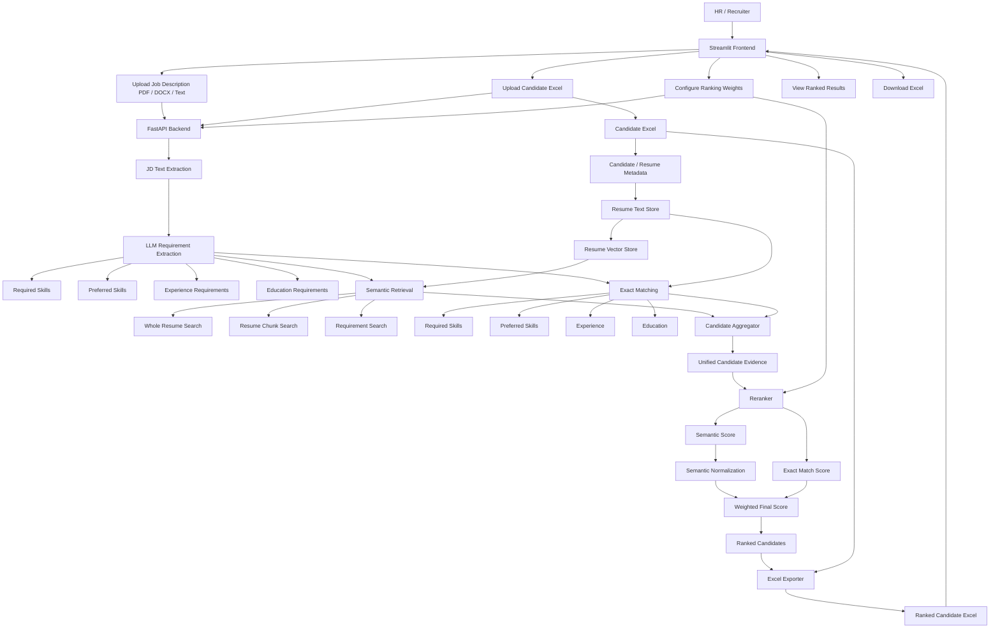

# PCRS — Palle Candidate Retrieval System

An intelligent AI-powered candidate retrieval and reranking engine designed for high-precision recruitment workflows. PCRS matches candidate resumes against Job Descriptions (JDs) using a hybrid approach combining **multi-granularity semantic vector retrieval** and **deterministic exact keyword matching**, producing a ranked and exportable Excel tracker.

---

## 🌟 Unique Selling Propositions (USPs)

What makes PCRS fundamentally superior to traditional keyword-matching ATS and simple RAG systems:

1. **Multi-Granularity Hybrid Retrieval**:
   - **Whole Resume Search**: Evaluates the candidate's broad domain fit and general background.
   - **Chunk-Level Search**: Discovers deep, specific technical details and achievements within individual projects or work experience sections.
   - **Requirement-Level Semantic Search**: Isolates each extracted JD requirement to match candidates who satisfy specific technical criteria.
   - **Deterministic Exact Matching**: Strict keyword verification for mandatory certifications, core languages, and explicit qualifications.
2. **AI Structured Requirement Dissection**:
   - Uses an LLM with strict schemas (`Pydantic`) to faithfully parse JDs into categorized requirements (_Required Skills, Preferred Skills, Experience, Education_) along with conservative search terms, avoiding hallucinated criteria.
3. **Multi-Aspect Weighted Reranking & Dynamic Normalization**:
   - Allows HR/recruiters to adjust weights on the fly (_Semantic vs. Exact, Whole-Resume vs. Best-Chunk vs. Best-Requirement_) to balance conceptual relevance and mandatory constraints.
   - Dynamically scales and normalizes vector distance scores into intuitive [0, 1] relevance metrics.
4. **Universal Document & Input Support**:
   - Ingests JDs in `.pdf`, `.docx`, `.txt` format or direct pasted text.
   - Automatically processes candidate resumes across multiple document types without code duplication.
5. **Auditable & Exportable Results**:
   - Enriches the original candidate tracker with detailed score breakdowns (_Semantic Score, Normalized Score, Exact Score, Final Score, Rank_) and exports ready-to-use Excel sheets.

---

## 🏗️ System Architecture



---

## 📁 Project Structure

```text
palle-candidate-retrieval-system/
├── data/
│   ├── resumes/               # Downloaded candidate resumes
│   ├── processed/             # Processed resume JSON store
│   ├── vector_store/          # FAISS vector store indices
│   └── output/                # Generated ranked Excel sheets
├── src/
│   ├── api/
│   │   └── main.py            # FastAPI application endpoints
│   ├── ingestion/
│   │   ├── xlsx_reader.py     # Candidate Excel parser
│   │   ├── resume_downloader.py
│   │   ├── resume_text_extractor.py
│   │   ├── document_text_extractor.py # Unified PDF/DOCX/TXT extractor
│   │   └── resume_text_store.py
│   ├── processing/
│   │   └── jd_requirements.py # LLM-based structured JD requirement extraction
│   ├── retrieval/
│   │   ├── resume_vector_store.py
│   │   ├── semantic_retriever.py
│   │   ├── exact_retriever.py
│   │   ├── candidate_aggregator.py
│   │   └── reranker.py
│   └── export/
│       └── excel_exporter.py  # Ranked Excel generator
├── streamlit_app.py           # Streamlit Web UI
├── requirements.txt
└── README.md
```

---

## 🛠️ Setup & Installation

### 1. Clone & create virtual environment

```bash
git clone <repo-url>
cd palle-candidate-retrieval-system

# Create and activate virtual environment
python -m venv .venv

# On Windows PowerShell:
.venv\Scripts\Activate.ps1

# On Linux/macOS:
source .venv/bin/activate
```

### 2. Install dependencies

```bash
pip install -r requirements.txt
```

### 3. Environment Variables

Create a `.env` file in the project root:

```env
GEMINI_API_KEY=your_gemini_api_key_here
```

---

## ⚡ Running the Application

### 1. Start the FastAPI Backend

```bash
uvicorn src.api.main:app --reload --port 8000
```

- Interactive API Docs (Swagger): [http://localhost:8000/docs](http://localhost:8000/docs)

### 2. Start the Streamlit Frontend

```bash
streamlit run streamlit_app.py
```

- Frontend UI: [http://localhost:8501](http://localhost:8501)

---

## 📊 End-to-End Workflow

1. **Upload**: Provide a Job Description (PDF/DOCX/TXT or pasted text) and a Candidate Tracker (`.xlsx`).
2. **Configure Weights**: Adjust semantic vs. exact match weights based on recruitment criteria.
3. **Retrieve & Rerank**: The system performs multi-aspect semantic vector search and exact term matching, normalizes distances, and reranks candidates.
4. **Export**: View the ranked results table on the UI and download the enriched Excel report.

---

## 🏢 Organization

Developed for **PALLE TECHNOLOGIES**.
