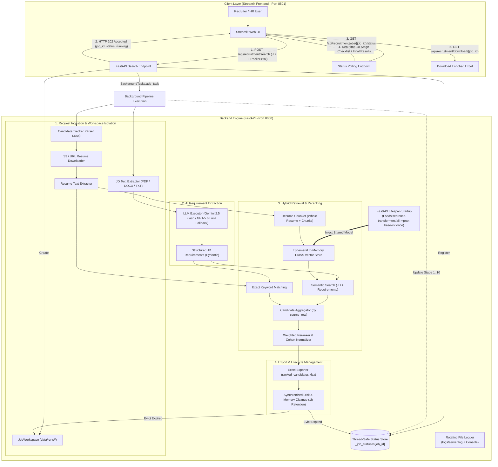

# PCRS — Palle Candidate Retrieval System

An intelligent, production-ready AI candidate retrieval and reranking engine designed for high-precision recruitment workflows. PCRS matches candidate resumes against Job Descriptions (JDs) using a hybrid approach combining **multi-granularity semantic vector retrieval** (`sentence-transformers/all-mpnet-base-v2` + FAISS) and **deterministic exact keyword matching**, producing a ranked and exportable Excel report.

---

## 🌟 Key Features & USPs

1. **Non-Blocking Background Execution & Live 10-Stage Progress**:
   - `POST /api/recruitment/search` instantly returns `HTTP 202 Accepted` with a backend-generated `job_id`.
   - The recruitment pipeline executes concurrently in the background.
   - Streamlit polls `GET /api/recruitment/jobs/{job_id}/status` to render real-time progress across all 10 stages (`Ingestion`, `JD Extraction`, `Resume Download`, `Text Extraction`, `Vector Store Creation`, `Semantic Search`, `Exact Search`, `Evidence Aggregation`, `Reranking`, `Excel Export`).
2. **Multi-Granularity Hybrid Retrieval**:
   - **Whole Resume Search**: Evaluates broad domain fit and candidate background.
   - **Chunk-Level Search**: Matches specific project accomplishments and detailed technical tasks.
   - **Requirement-Level Semantic Search**: Queries candidate resume chunks against each extracted JD requirement independently.
   - **Deterministic Exact Matching**: Strict keyword verification for mandatory skills, tools, and certifications.
3. **AI Structured Requirement Extraction**:
   - Uses resilient LLM extraction with strict Pydantic schemas across **OpenAI** and **Gemini** providers with automatic fallback.
   - Faithfully categorizes criteria into _Required Skills_, _Preferred Skills_, _Experience_, and _Education_.
4. **Multi-Aspect Weighted Reranking & Cohort Normalization**:
   - Ranks candidates using a weighted formula combining normalized semantic similarity and exact term matching.
   - Dynamically inverts and scales Euclidean distances into intuitive $[0.0, 1.0]$ relevance scores.
5. **Isolated Request-Scoped Workspaces & Synchronized Cleanup**:
   - Every search request runs in its own dedicated, isolated workspace under `data/runs/<job_id>/` (`input/`, `resumes/`, `output/`).
   - 1-hour automatic retention cleanup safely purges expired directories and in-memory status entries synchronously.
6. **Optimized Shared Model Lifecycle**:
   - The heavy embedding model (`all-mpnet-base-v2`) is loaded **once** at server startup via FastAPI `lifespan` and reused across requests.
   - FAISS vector stores remain strictly ephemeral and request-scoped in memory.
7. **Structured Safe Error Handling & Rotating Logs**:
   - Sanitizes and classifies failures (e.g. `LLM_RATE_LIMIT_ERROR`, `INPUT_VALIDATION_ERROR`) without leaking sensitive API keys.
   - Logs to both console and a rotating file (`logs/server.log`, max 10MB, 5 backups).

---

## 🏗️ System Architecture



---

## 📁 Project Structure

```text
palle-candidate-retrieval-system/
├── data/
│   └── runs/                  # Request-scoped isolated workspaces (data/runs/<job_id>/)
│       └── .gitkeep
├── logs/                      # Server log directory (rotating server.log)
│       └── .gitkeep
├── src/
│   ├── api/
│   │   └── main.py            # FastAPI application, lifespan lifecycle & endpoints
│   ├── common/
│   │   ├── errors.py          # Structured error models & classification
│   │   └── job_workspace.py   # Request isolation & filesystem lifecycle
│   ├── export/
│   │   └── excel_exporter.py  # Enriched ranked Excel generator
│   ├── ingestion/
│   │   ├── document_text_extractor.py # Unified PDF/DOCX/TXT extractor
│   │   ├── resume_downloader.py       # S3 / HTTP resume downloader
│   │   ├── resume_text_extractor.py   # Resume PDF/DOCX text extraction
│   │   └── xlsx_reader.py             # Candidate Excel validation & parser
│   ├── llm/
│   │   ├── llm_factory.py     # Multi-provider LLM initializers (Gemini / OpenAI)
│   │   └── llm_executor.py    # Fallback retry executor
│   ├── processing/
│   │   └── jd_requirements.py # LLM structured requirement extraction
│   └── retrieval/
│       ├── candidate_aggregator.py # Multi-aspect candidate aggregation
│       ├── exact_retriever.py      # Substring exact term retriever
│       ├── reranker.py             # Mathematical scoring & cohort normalization
│       ├── resume_vector_store.py  # mpnet-base-v2 model & FAISS factory
│       └── semantic_retriever.py   # Semantic similarity retriever
├── tests/
│   ├── test_e2e_search.py          # End-to-end integration tests
│   ├── test_embedding_lifecycle.py # Lifespan & shared model reuse tests
│   ├── test_error_handling.py      # API & LLM error classification tests
│   ├── test_excel_status.py        # Excel export status reporting tests
│   ├── test_job_lifecycle.py       # Job isolation & path traversal tests
│   ├── test_job_status.py          # Real-time progress & status tracking tests
│   └── test_ranking_logic.py       # Mathematical scoring & monotonicity tests
├── streamlit_app.py           # Streamlit Frontend Web UI
├── requirements.txt           # Project dependencies
├── pytest.ini                 # Pytest configuration
└── README.md
```

---

## 🛠️ Setup & Installation

### 1. Prerequisites

- Python 3.10+
- Git

### 2. Clone Repository & Setup Virtual Environment

```powershell
# Clone repo
git clone https://github.com/Narasimha-kambham/palle-candidate-retrieval-system.git
cd palle-candidate-retrieval-system

# Create virtual environment
python -m venv .venv

# (Windows PowerShell only - if script execution is blocked on your system):
Set-ExecutionPolicy -Scope CurrentUser -ExecutionPolicy RemoteSigned -Force

# Activate virtual environment (Windows PowerShell)
.\.venv\Scripts\Activate.ps1

# (Windows Command Prompt)
# .venv\Scripts\activate.bat

# (Linux / macOS)
# source .venv/bin/activate

# Install dependencies
pip install -r requirements.txt
```

---

### 3. Configure Environment Variables

Create a `.env` file in the root directory:

```env
# Google Gemini API Key
GEMINI_API_KEY=your_google_gemini_api_key

# OpenAI API Key (for fallback)
OPENAI_API_KEY=your_openai_api_key
```

---

## ⚡ Running the System

### 1. Start the FastAPI Backend

```powershell
uvicorn src.api.main:app --reload --port 8000
```

- **Backend API**: `http://localhost:8000`
- **Interactive Swagger Docs**: `http://localhost:8000/docs`

### 2. Start the Streamlit Frontend

In a separate terminal window:

```powershell
.\.venv\Scripts\Activate.ps1
streamlit run streamlit_app.py
```

- **Web Interface**: `http://localhost:8501`

---

## 🧪 Running Tests

To run the automated test suite:

```powershell
# Run all unit, lifecycle, and ranking tests:
pytest tests/test_job_lifecycle.py tests/test_ranking_logic.py tests/test_excel_status.py tests/test_embedding_lifecycle.py tests/test_error_handling.py -v

# Run full suite:
pytest -v
```

---

## 🏢 Organization

Developed for **PALLE TECHNOLOGIES**.
